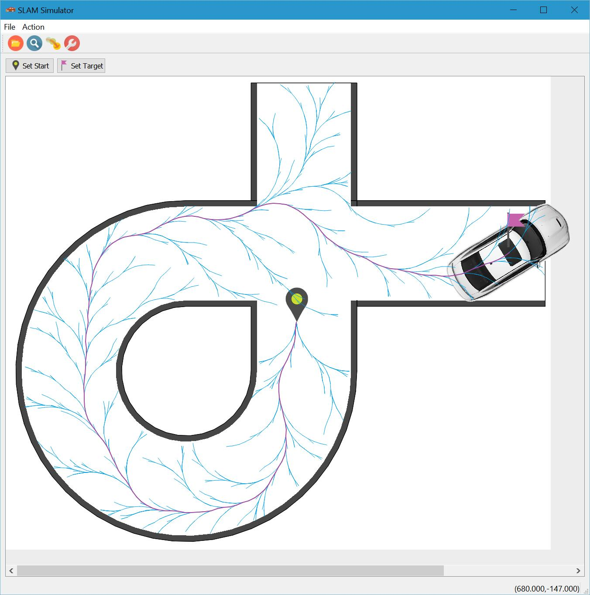
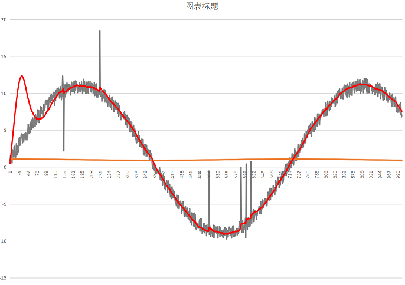
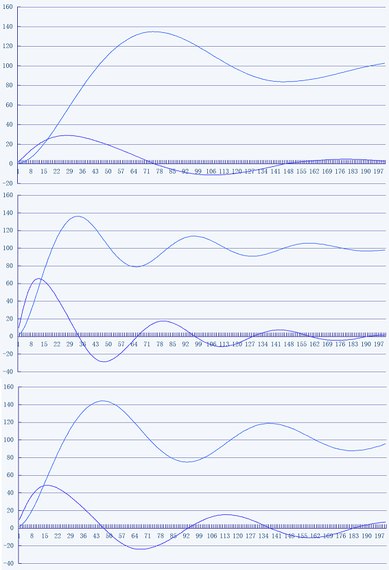

# SLAM
Robotics Simultaneous Localization and Mapping  
### Current Progress:  
#### [- QSLAM ,Qt SLAM GUI Program](/QSLAM)
#### [- LIDAR Sensor Data Acquisition and Visulization](/LIDAR)  
#### [- Kalman Filter](/KalmanFilter)  
#### [- Map Search Algorithm Comparison(BFS, A* ,Dynamic Programming,RRT)](/Search/GraphSearch)  
#### [- Smooth Algorithm](/Search/GraphSearch)  
#### [- PID Simulator(one dimension)](/PID)  
#### [- Vehicle Dynamic Model Simulation](Search/GraphSearch)  
    
=====  
###QSLAM - Qt SLAM GUI Program  
This is a GUI program for visualizing the SLAM algorithms,here are the current progress:   
-Read bitmap directly as map,can easily create test map  
-Use mouse to set start and target position arbitarily on the map  
-Visualize the search trial route and shortest route after searching  
-Driving animation
  
Here are some test results:  
   
    
=====  
    
###XV11_LIDAR_Visualizer
A small program to debug the XV-11 LIDAR module.Built with Qt and it's cross platform on Windows/Mac/Linux.
Here's the main features:  
-Visualizing the dot data with selectable range from 1-10 meters  
-Options to filter out the bad point data  
-Showing how many point data are valid on status bar  
-Showing all the text data with format 0 - 360   : speed /rpm | point1  point2  point3  point4  

   

   
  
=====
###Kalman Filter  
Implemented a highly portable Kalman filter module in C.Here are some experiments of fusing gyroscope and accelerometer data.As we can see,Kalman filter does a good job fusing the sensors data and getting rid of gyro drifting.But it can not filter out the accelerometer spike noise.  
Notice that at the beginning of the red curve there’s a bump,which is caused by gyro drift and filtered out by Kalman filter later on.  
  
  
  
  
=====
###Searching Algorithms
Following searching algorithms are implemented in this projects:  
-BFS 
-Dynamic Programing
-A* ,2D(x,y) and 3D(x,y,theta)  
-RRT Using Vehicle Dynamic Model,5D(x,y,theta,speed,steering speed)  
  
  
Here are the test results.  
###Comparison of BFS, DP, A* 
In real life,situation is more complicated.For example,if we are heading to a place in rush hour and we need to go through a traffic light.Then perhaps we don't want to take a left turn because it's gonna wait for 5 minutes.Instead we may want to take a detour,which is faster then taking a left turn.This problem can be solved by adding a third dimension,which is orientation factor.Consider the following example:  
start(4,2)  
target(0,0)  
{1, 0, 1, 1, 1},  
{1, 0, 1, 0, 1},  
{1, 1, 1, 1, 1},  
{0, 0, 1, 0, 0},  
{0, 0, 1, 0, 0},	 
    
Using three dimensional(x,y,orientation) A* we can get the following path:  
Search effort: 1  
Shortest path:14  
  
Where  
'T' is target  
'#' is obstacle  
"^,>,V,<" are trajectories  
'+' is an overlap of trajectories  
  
 
###RRT
RRT Searching with Smooth Path and Obstacle Avoidance  
  
  
RRT Searching Using Vehicle Dynamic Model  
  
  
  
  
    
=====
#### ● Smooth algorithm  
After calculating the shortest path,we want to smooth the path.  
  
   
Here is another example of trajectories smooth algorithm:  
  
   
=====
###PID Control and Vehicle Kinematic Simulation  
Here's what have been done in this project:  
-Standard PID controller  
-PID twiddler(coefficient self optimization)  
-One dimensional Car simulation(speed,distance,acceleration,friction,wind resistance,etc)  
-Two dimensional Vehicle simulation(vehicle kinematic,dynamic model,etc)  
  
Here are some test results:  
###PID Control  
  
  
###PID Coefficient Self Optimization  
  
  
###2D Vehicle Simulation  
A vehicle steering at a fixed angle and fixed speed,whose trajectory is exactly a circle.  
  
  
